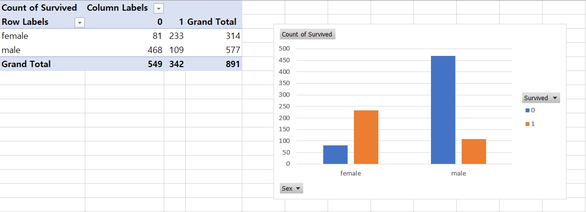
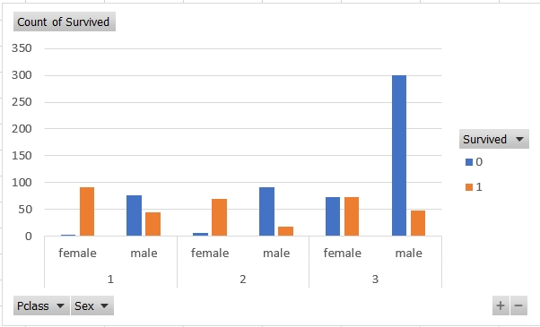
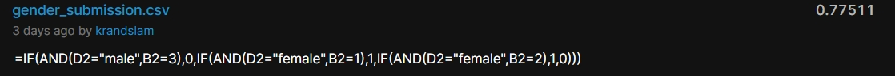

The goal of this exercise is to analyze train data of people who took the Titanic and predict who survived or not in test data.  
To analyze train data, pivot chart in excel was used.  

From the background knowledge, female took priority on taking a life boat.  
The pivot chart regarding gender follows below.  

pivot chart (gender)
--------------

gender_submission.csv has a result that females survive and males do not survive.  
It was calculated in excel formula at test.csv, =IF(D2="female",1,0)  
This result was copied and pasted to submission file to submit.  
Submitted result on kaggle follows below.

kaggle submission result (gender)
--------------

The result was 76.555% right.  

To improve the accuracy, other factors of survival in data was further analyzed.
Pclass, which is ticket class is also considered in pivot chart below.  

pivot chart (gender,class)
--------------

Male in third class survived in low chance in test data, so setted that male in test data to not survive.  
Females in first and second class survived in high chance in test data, so setted those females in test data to surive.  
The result was calculated in excel formula at test.csv, =IF(AND(D2="male",B2=3),0,IF(AND(D2="female",B2=1),1,IF(AND(D2="female",B2=2),1,0)))  
Submitted result on kaggle follows below.

kaggle submission result (gender,class)
--------------

The result improved to 77.551%.  

To further improve accuracy, the attempt was made to add more conditional statements with 77.551% accuracy statement.  
This attempt did not improve further accuracy, and it even lowered the accuracy to 60%.  
At first, it made no sense to decrease the accuracy.  
However, in later class, the term overfitting data was introduced and found that this was the reason why the accuracy got lower with this attempt.  
