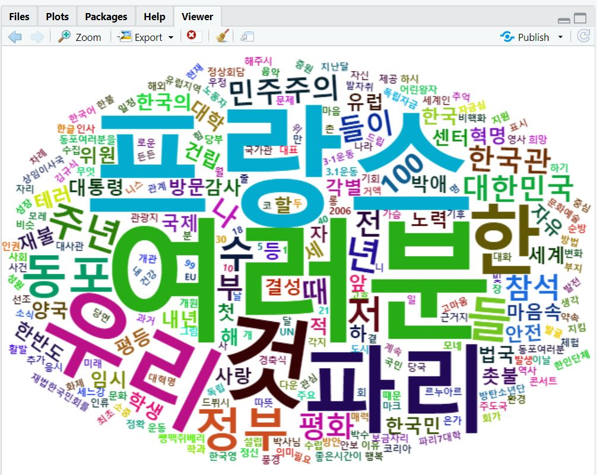

The goal of this practice is to analyze the text of President Moon's Paris speech in 2018.  
The R code analyzed the frequency of his Korean word usage and generated word cloud to visualize the result.  
The word cloud result follows below.

File description:  
- 대통령파리연설.txt: the text of speech
- Ex01.R: R code that analyzes the text
- word_cloud.jpg: result of analysis
