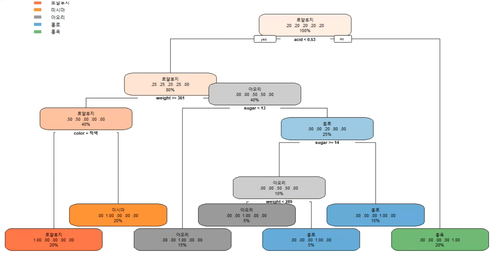

The goal of this practice is to predict the type of apple from the information in apple.csv  
apple.csv contains weight, sugar content, acid, color information of 25 apples, and 5 apples exist for each model.  

First, to understand data average weight, sugar contetn, acid were calculated for each model.  
It was hard to establish a model that can easily distinguish apple, because the data calculated(average) did not differ much for each mode.  

So, machine learning was introduced to let computer predict a type of apple after training.  
Train data and test data were split into 8:2. 
rpart package was used for this classification problem.  
Decision tree obtained after training follows below.

To prevent overfitting, pruning was conducted.  
Complexity Parameter was found by plotcp function.  

Since cp with 0.018 had the lowest X-val Relative error, pruning was done with cp = 0.018 to improve accuracy.  
After pruning, prediction was done with predict function.  
To evalute prediction result, Kappa coefficient was calculated.  

From the diagram above, accuracy was 80% and Kappa coefficient was 0.75, which is quite high.  
